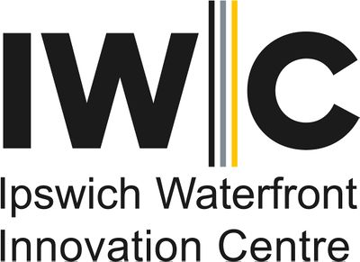
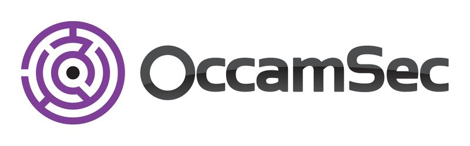

---

layout: col-sidebar
title: OWASP Suffolk
site_side: true
tags: suffolk
region: Europe
currency: gbp
---

 

## Welcome

Welcome to the Suffolk chapter homepage. The chapter leaders are <a href="mailto:wojciech.cichon@owasp.org">Wojciech T Cichon</a>
 and <a href="mailto:abhinav.sejpal@owasp.org">Abhinav Sejpal</a>.
  
Please follow as on [Twitter](https://twitter.com/owaspsuffolk)  and please subscribe to our [Youtube](https://www.youtube.com/channel/UCGU_bGraZZZc37pQytdaH6w) channel.
 

 
## Meeting Sponsors

The following is the list of organisations who supported OWASP Suffolk chapter by providing funds or venue.

<table cellpadding="15" cellspacing="0">

<tr>

<td>

</td>

<td>

</td>

</tr>

</table>

#### Call For Speakers

If you would like to present a talk on Application Security at future OWASP Suffolk Chapter events - please email the proposed talk title, abstract and 
speaker bio to one of the Chapter Leader 

```
 wojciech.cichon@owasp.org
 
 abhinav.sejpal@owasp.org
```

## Next Meeting/Event(s)

##### OWASP Suffolk Chapter - March Meetup #####

Date : Wednesday, March 25, 2020, 7:00 PM to 7:15 PM

Venue : Remote (Before the meetup will start, We will email link to everyone whoever registred)

 * OWASP Suffolk Introduction, Welcome and News - WTC

Welcome and an update on OWASP Projects & Events from the OWASP Suffolk Chapter Leader.

 *  how to prevent Dev from committing secrets and credentials into git repositories by Abhinav Sejpal

Abstract: Sensitive information such as the AWS keys, access tokens, SSH keys etc. are often erroneously leaked via the public source code repositories due to accidental git commits. This can be avoided by using pre-commit hooks like “Talisman” which checks for sensitive information in the files before commits or push activity.

Speaker Social Info :

Website : https://www.bugwrangler.in/ 

Twitter : https://twitter.com/AbhinavSejpal 


 **TICKETS**:
 
 All our events are free to attend for both members and non-members of OWASP
 and is open to anyone interested in application security and cyber
 security. Please note that you MUST RSVP to book your place and get a
 ticket to be admitted to the event by building security - your name will
 be checked against the guest list. Register to attend this event
 at OWASP Suffolk Chapter -
 [Meetup](https://www.meetup.com/OWASP-Suffolk-Chapter/) - RSVP to attend
 
 ----

**Code of Conduct**:


We hope you enjoy our events, we care deeply about inclusivity and diversity so that OWASP is a comfortable and welcoming community for everyone. Please reach out to one of our chapter leaders if you have any feedback or would like to speak to us, we take these matters very seriously. You can find out more about our policies here: <https://www.owasp.org/index.php/Governance/Conference_Policies>
